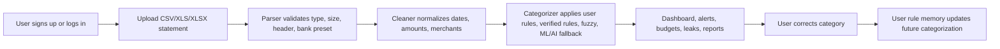

# MoneyLeak AI Architecture

MoneyLeak AI is a React and FastAPI application for uploading Indian bank statements, normalizing transactions, detecting spending leaks, and generating reports.

## Runtime Components

- Frontend: React, Vite, Tailwind CSS, Recharts.
- Backend API: FastAPI routers under `/api`.
- Database: PostgreSQL in production, SQLite-compatible tests locally.
- Migrations: Alembic under `backend/alembic`.
- Reports: ReportLab PDF, CSV, and Excel generation.
- Intelligence: deterministic rules first, optional ML and AI-assisted merchant discovery as fallback layers.

## Core Workflow

## Ownership Boundary

Every persisted financial record carries `user_id`. API routes resolve `current_user` from a JWT and filter by that user before reading or mutating statements, transactions, budgets, goals, report data, and category rules.

